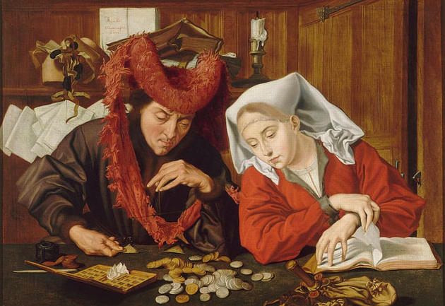
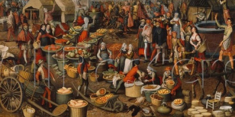

# Capitalismo industrial

     O capitalismo é um sistema econômico e social baseado na propriedade privada e na acumulação de capital. 
</img>

Surgiu no século XV, na passagem da Idade Média para a Idade Moderna, a partir da decadência do sistema feudal e do nascimento de uma nova classe social, a burguesia, nessa época produtos e bens chegavam aos portos da europa vindas principalmente, de principais países asiáticos .

    A produção de bens era artesanal 

</img>

# O capitalismo teve suas fases  
- Capitalismo Comercial ou Mercantil (pré-capitalismo)
- Capitalismo Industrial ou Industrialismo
- Capitalismo Financeiro ou Monopolista

# As principais características do Capitalismo são:
- Propriedade privada
- Lucro
- Trabalho assalariado

---

# 1ª Revolução Industrial

Somente no seculo XVII surgiram as manufaturas "Um tipo de fabrica onde o processo é artesanal "

ja no seculo XVIII aconteceu a 1º revolução industrial na inglaterra e posteriormente expandiu-se para europa.

    A revolução éra tecnológica, com a invenção de maquinas que facilitavam a produção de bens em maior escala com menor tempo e esforço.

As principais fontes de energia para tais maquinas eram hidráulica e carvão mineral .

O processo de urbanização acompanhavam os meios energéticos, fabricas eram construídas próximas a minas de carvão  e rios .
A população rural migrava para as proximidades dessas fabricas e nesse processo os primeiros problemas urbanos começavam a aparecer.

Com a instalação das industrias e a procura por trabalhadores  ouve uma expansão populacional e grande transformação urbana .

Essas transformações desordenadas geraram grandes problemas como:
- Criação de muitas habitações em estado precário
- falta de saneamento básico 
- Pobreza 
- baixos salários
- trabalho abusivo
---

# socialismo

Socialismo refere-se a qualquer uma das várias teorias de organização econômica que advogam a administração e propriedade pública ou coletiva dos meios de produção e distribuição de bens, propondo-se a construir uma sociedade caracterizada pela igualdade de oportunidades e meios para todos os indivíduos, com um método isonômico de compensação.

    O socialismo moderno surgiu no final do século XVIII, tendo origem na classe intelectual e nos movimentos políticos da classe trabalhadora, que criticavam os efeitos da industrialização e da propriedade privada sobre a sociedade. 
    Karl Marx afirmava que a luta de classes era responsável pela realidade social, e que este conflito inevitavelmente resultaria no socialismo através de uma revolução do proletariado, tornando-se uma fase de transição do capitalismo para um novo modelo de sociedade que não seria dividido em classes sociais hierárquicas, num modelo essencialmente comunista.

    A maioria dos socialistas possui a opinião de que o capitalismo concentra injustamente a riqueza e o poder nas mãos de um pequeno segmento da sociedade — denominado por Marx de Burguesia — que controla o capital e deriva a sua riqueza da exploração de outras classes sociais, criando uma sociedade desigual, que não oferece oportunidades iguais de maximização de suas potencialidades a todos.

    Friedrich Engels, um dos fundadores da teoria socialista moderna, e o socialista utópico Henri de Saint Simon defendem a criação de uma sociedade que permita a aplicação generalizada das tecnologias modernas de racionalização da atividade econômica, eliminando o caos na produção do capitalismo.
    Isto permitiria que a riqueza e o poder fossem distribuídos com base na quantidade de trabalho despendido na produção, embora não haja concordância entre os socialistas sobre como e em que medida isso poderia ser alcançado.

    O socialismo não é uma filosofia de doutrina e programa fixos; seus ramos defendem um certo grau de intervencionismo social e racionalização econômica (geralmente sob a forma de planejamento econômico), às vezes opostas entre si, como o socialismo de estado e o socialismo libertário. Uma característica da divisão do movimento socialista é entre os reformistas, chamados de socialistas democráticos, e revolucionários sobre como uma economia socialista deveria ser estabelecida. Alguns socialistas defendem a nacionalização completa dos meios de produção, distribuição e troca, outros defendem o controle estatal do capital no âmbito de uma economia de mercado.

# Tipos de Socialismo 
- Socialismo utópico
- Socialismo científico
- Anarquismo
- Socialismo cristão

fonte: https://pt.wikipedia.org/wiki/Socialismo#:~:text=Socialismo%20refere%2Dse%20a%20qualquer,os%20indiv%C3%ADduos%2C%20com%20um%20m%C3%A9todo

 

 